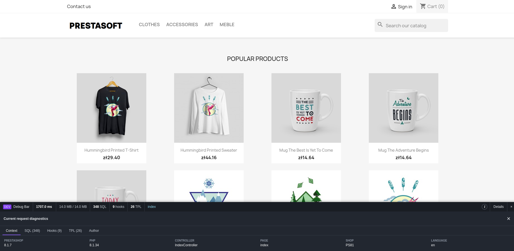

# PrestaShop Debug Bar

A free and open-source storefront diagnostics bar for PrestaShop developers and store administrators.

PrestaShop Debug Bar provides useful information about the current request without requiring PrestaShop's global debug mode. It is displayed only when the browser has a valid active back office employee session. Regular customers and anonymous visitors do not receive the bar or its CSS and JavaScript assets.

## Screenshot





## Demo video


[](https://youtu.be/DY_dujQwAT8)

## Features

- SQL query count and individual SQL statements
- query execution time and slow-query highlighting
- configurable maximum number of collected entries
- list of executed PrestaShop hooks with optional total execution time and call count
- list of loaded Smarty TPL templates
- request duration, current memory usage and peak memory usage
- controller, page, shop and language information
- PrestaShop and PHP version information
- independent switches for the individual diagnostic sections
- standard PrestaShop HelperForm configuration page
- collapsible interface with a persistent browser state
- localized author information based on the employee profile language

The module sends private no-cache response headers while the bar is active. Its collectors are not started for ordinary storefront visitors.

## Compatibility

| Platform | Supported versions |
| --- | --- |
| PrestaShop | 1.6, 1.7, 8.x and 9.x |
| thirty bees | 1.7 |
| PHP | 7.1 through 8.4 |

## Installation

1. Download or clone this repository.
2. Make sure the module directory is named `psoft_debugbar`.
3. Copy the directory to your store's `modules` directory.
4. Open the PrestaShop module manager.
5. Find **PrestaShop Debug Bar** and install it.
6. Open the module configuration page and select the diagnostic sections you want to display.

Example:

```bash
git clone https://github.com/pgrono/prestashop-debugbar.git psoft_debugbar
cp -R psoft_debugbar /path/to/prestashop/modules/
```

The module installs PrestaShop `Db` and `Hook` overrides to collect individual SQL statements and hook execution times. Installation may fail if another module already overrides `Db::query()` or `Hook::exec()`. Review existing overrides before combining profiling modules.

## Configuration

The configuration page allows you to enable or disable:

- the complete debug bar
- SQL query details
- executed hooks
- hook execution-time measurement
- loaded TPL templates
- performance information
- page and environment context

The number of entries displayed in each detailed list can be limited from 10 to 300. The default limit is 100.

## Upgrading from `psoft_devbar`

`psoft_debugbar` has a different technical name and is treated by PrestaShop as a new module.

Do not install both modules at the same time. Follow the instructions in [UPGRADING.md](UPGRADING.md) to remove the legacy module and install PrestaShop Debug Bar safely.

## Security

The bar can expose SQL statements, template paths, controller names and environment details. It should only be available to trusted administrators.

Before collecting or displaying data, the module verifies:

- the back office employee cookie
- the employee password hash stored in the session
- the session lifetime
- the optional IP address restriction
- the employee account status
- the employee's authorization for the current shop

Keep the module disabled on production stores when diagnostics are not needed. Never weaken the employee-session checks or expose the bar to customers.

## Languages

English source strings and translations are included for:

- English
- Polish
- German
- French
- Spanish
- Czech
- Italian
- Portuguese
- Dutch
- Danish

The author section follows the language configured in the logged-in employee profile. Unsupported profile languages fall back to English. Polish profiles link to PrestaSoft, while all other profiles link to PrestaAddons.

## Support the project

PrestaShop Debug Bar is available free of charge under the MIT License. If it saves you time, you can support further development by buying me a coffee:

[Buy me a coffee](https://buymeacoffee.com/pgrono)

You can also find commercial PrestaShop modules and add-ons at:

[PrestaAddons.com](https://prestaaddons.com)

## Contributing

Bug reports and pull requests are welcome. When reporting an issue, include:

- the PrestaShop or thirty bees version
- the PHP version
- steps required to reproduce the problem
- relevant error messages or logs with sensitive information removed

Please do not include customer data, credentials, private SQL values or other sensitive store information.

## License

PrestaShop Debug Bar is released under the [MIT License](LICENSE).
